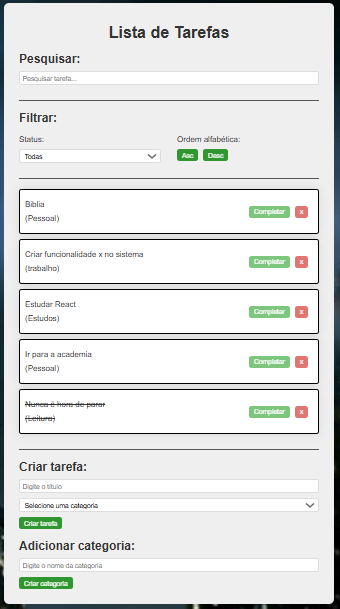

# 📝 To-do List - Projeto em React

Bem-vindo ao meu projeto pessoal de **Lista de Tarefas**, desenvolvido com **React**!  
Essa aplicação tem como objetivo ajudar o usuário a organizar melhor suas atividades diárias.

---

## 🚀 Funcionalidades

- ✅ Adicionar tarefas com título e categoria
- ✏️ Marcar tarefas como concluídas
- ❌ Remover tarefas
- 🔍 Buscar tarefas por texto
- 🔠 Filtrar tarefas por ordem alfabética
- 🟢 Filtrar tarefas por status (completas ou pendentes)
- 📂 Criar novas categorias dinamicamente

---

## 🎯 Objetivo do Projeto

Este projeto foi criado com o intuito de:
- Praticar os fundamentos do React (componentes, props, estados)
- Aplicar manipulação de listas e formulários
- Desenvolver uma interface funcional e interativa
- Aprimorar conhecimentos em versionamento com Git e GitHub

---

## 📸 Demonstração



---

## 🛠️ Tecnologias Utilizadas

- [React](https://reactjs.org/)
- HTML5 & CSS3
- JavaScript (ES6+)
- Git & GitHub

---

## 🧠 Conceitos Trabalhados

- React Hooks (`useState`)
- Props e componentes reutilizáveis
- Estrutura condicional e de repetição no JSX
- Lógica de filtros e ordenação
- Manipulação de arrays e objetos
- Controle de formulários

---

## 🗂️ Estrutura de Pastas

src/
├── components/
│ ├── Todo.jsx
│ ├── TodoForm.jsx
│ ├── Search.jsx
│ ├── Filter.jsx
│ └── Category.jsx
├── App.jsx
├── index.js
└── App.css


---

## 📦 Como rodar localmente

```bash
# Clone o repositório
git clone https://github.com/renan-almeida/To-do-List.git

# Entre na pasta
cd To-do-List

# Instale as dependências
npm install

# Rode o projeto
npm run dev


#🙋‍♂️ Autor
## Desenvolvido com dedicação por **Renan Almeida**
🔗 GitHub[]
